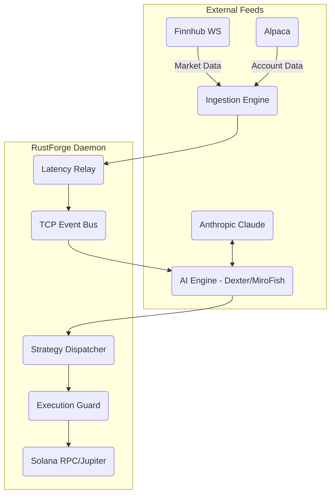

# RustForge Architecture Overview

This document outlines the core quantitative trading architecture post-Phase 2 implementation. It maps the ingestion, intelligence, execution, and observability domains.

## 1. System Topology

## 2. Quantitative Algorithms

### Market Making (Avellaneda-Stoikov)
Located in `crates/executor/src/strategies/market_making/`.
Calculates a reservation price around mid-market based on current inventory, volatility, and risk aversion settings. Actively skews bid/ask quotes to maintain a dynamic spread. Includes an Adverse Selection Guard that tracks VPIN order flow toxicity to widen quotes during informed sweeps.

### Statistical Arbitrage
Located in `crates/executor/src/strategies/stat_arb/` & `pairs/`.
Relies on Engle-Granger tests for cointegration. Executes based on a rolling Z-score spread model to fade statistical anomalies between correlated assets.

### Deep RL Execution (PPO)
Located in `crates/ml/src/rl/`.
A Proximal Policy Optimization actor-critic model running on a mocked Markov Decision Process. Used to optimize slicing sequences dynamically against static VWAP/TWAP order routers.

## 3. Reliability Patterns
- **API Guardrails**: Strict Token Bucket limiters for external vendors (Anthropic) in `ai/src/client/rate_limiter.rs` & exponential WebSocket backoffs.
- **Verification**: Zero-latency Solana balance checks and dynamic depth-based slippage caps before trade execution in `crates/executor/src/`.
- **Schema Safety**: `jsonschema` bounds on LLM hallucination outputs.
